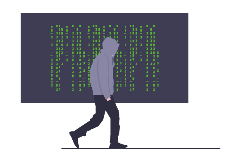

rihad@localhost:~$ whoami

<p align="center"></p>

## The Chronicles of a Cybersecurity Maverick

As a security research and machine learning specialist; I’m a Cybersecurity Maverick, blending cutting-edge technology with a touch of wizardry to transform complex challenges into groundbreaking solutions. My career is a continuous quest to not only understand the inner workings of systems but also to fortify them against the unseen threats lurking in the digital wilderness

* A master of the dark arts, with a focus on:
  * Red Team Adversarial Emulations (because who doesn't love a good game of cat and mouse?)
  * Windows Internals (the inner workings of the beast, if you will)
  * Offensive R&D (pushing the boundaries of what's possible, and then some)
## Talents

* **Reverse Engineering:** because sometimes you need to take things apart to see how they tick
* **Physical Security:** because locks are meant to be picked, and walls are meant to be climbed
* **Web Application Security:** because the web is a wild west, and someone's gotta keep the outlaws in check
* **AWS Security:** because the cloud is the new frontier, and we need to secure it
* **Hardware/Electronics:** because sometimes you need to get your hands dirty and build something from scratch
* **Secure Code Review:** because even the best of us can use a little help from our friends
* **Machine Learning & AI:** because teaching machines to think is the next best thing to being a wizard
  * **Deep Learning:** because sometimes you need neural networks as deep as your coffee addiction
  * **Computer Vision:** because teaching machines to see is like giving them superhero powers
  * **Natural Language Processing:** because making machines understand humans is harder than understanding humans
  * **Data Science:** because finding patterns in chaos is an art form
  * **MLOps:** because even AI needs a reliable pipeline to thrive

## The Blog: A Journey of Discovery

* This is where I'll be sharing my thoughts, experiences, and adventures in the world of cybersecurity
* Expect posts on:
  * My learning experiences (the good, the bad, and the ugly)
  * Challenges I've faced (and overcome, because that's what heroes do)
  * Projects I've worked on (the ones that didn't blow up in my face, anyway)
  * Research I've conducted (because curiosity is a powerful thing)

* If you've got a topic in mind, hit me up and I'll see what I can do
* Feedback is always welcome, because I'm not perfect (but I'm working on it)

## Welcome to the Ride!
* Buckle up, folks, because this is going to be a wild ride
* Let's do this!

## Battle Station
* Main Rig: Because every warrior needs their trusty steed
  * Custom-built beast running Kali Linux (btw)
  * Multiple screens for maximum visibility into the digital realm
  * Mechanical keyboard for that satisfying tactical feedback
  * Ai/ML weapons PyTorch and Scikit-learn for my AI work, enabling me to create custom neural network architectures and machine learning models

## Current Missions
* Project Shadowkeeper: Building next-gen security tools
* Operation Neural Shield: Implementing AI-powered threat detection
* Mission Zero-Day: Researching novel attack vectors

## Trophy Room
* Speaker at major security conferences
* Published research on advanced persistent threats
* Multiple CVEs under the belt
* Bug bounty hall of fame entries

## Digital Arsenal
* Offensive Tools:
  * Custom-built penetration testing framework
  * Advanced malware analysis toolkit
  * Network protocol fuzzer

* Development Stack:
  * Python for rapid prototyping and automation
  * Rust for when performance matters
  * Go for robust backend services

* AI/ML Weapons:
  * PyTorch for deep learning operations
  * Scikit-learn for classical ML approaches
  * Custom neural network architectures

```
     _____  _ _               _ 
    |  __ \(_) |             | |
    | |__) |_| |__   __ _  __| |
    |  _  /| | '_ \ / _` |/ _` |
    | | \ \| | | | | (_| | (_| |
    |_|  \_\_|_| |_|\__,_|\__,_|
                    
    [System Status: Always Learning]
```

## License: The Digital Deadbolt
Copyright (c) 2025 Rihad Variawa - The Security Wizard

Permission is hereby granted, free of charge, to any entity brave enough to obtain a copy
of this software and associated documentation files (the "Arsenal"), to deal
in the Arsenal without restriction, including without limitation the rights
to use, copy, modify, merge, publish, distribute, sublicense, and/or sell
copies of the Arsenal, and to permit persons to whom the Arsenal is
furnished to do so, subject to the following conditions:

1. The above copyright notice, this permission notice, and the following disclaimer
   shall be included in all copies or substantial portions of the Arsenal.

2. Any attempt to use this Arsenal for malicious purposes, including but not limited
   to unauthorized system access or data breaches, is strictly prohibited and will
   be met with extreme prejudice.

THE ARSENAL IS PROVIDED "AS IS", WITHOUT WARRANTY OF ANY KIND, EXPRESS OR
IMPLIED. IN NO EVENT SHALL THE SECURITY WIZARD OR COPYRIGHT HOLDERS BE LIABLE
FOR ANY CLAIM, DAMAGES OR OTHER LIABILITY, WHETHER IN AN ACTION OF CONTRACT,
TORT OR OTHERWISE, ARISING FROM, OUT OF OR IN CONNECTION WITH THE ARSENAL
OR THE USE OR OTHER DEALINGS IN THE ARSENAL. USE AT YOUR OWN RISK, WARRIOR.